# sysopctl

`sysopctl` is a custom Linux command-line utility designed for managing system resources and tasks efficiently. This repository contains the `sysopctl` script and its accompanying manual.

## Features
- Service management (list, start, stop services)
- Display system load
- Check disk usage
- Monitor real-time process activity
- Analyze logs
- Backup files from a specified path

## Installation

1. Clone this repository to your local machine:
   ```bash
   git clone https://github.com/yourusername/sysopctl.git
   ```

2. Navigate to the directory:
   ```bash
   cd sysopctl
   ```

3. Grant execute permissions to the `sysopctl` script:
   ```bash
   chmod +x sysopctl
   ```

4. Move the script to a directory in your `PATH` for global access:
   ```bash
   sudo mv sysopctl /usr/local/bin/
   ```

5. Install the manual file :
   ```bash
   sudo cp sysopctl.8 /usr/share/man/man8/
   sudo mandb
   ```
## Implementing sysopctl in local system along with its manual
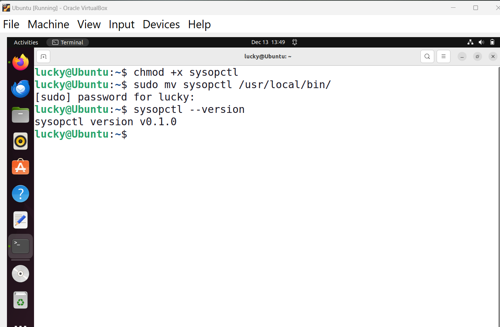

Implementing Manual 
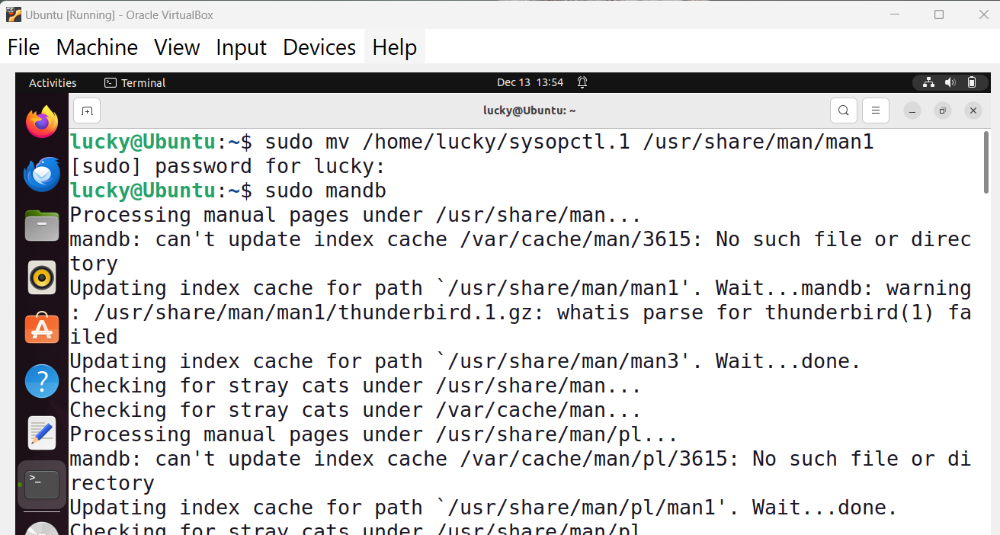

Viewing manual 
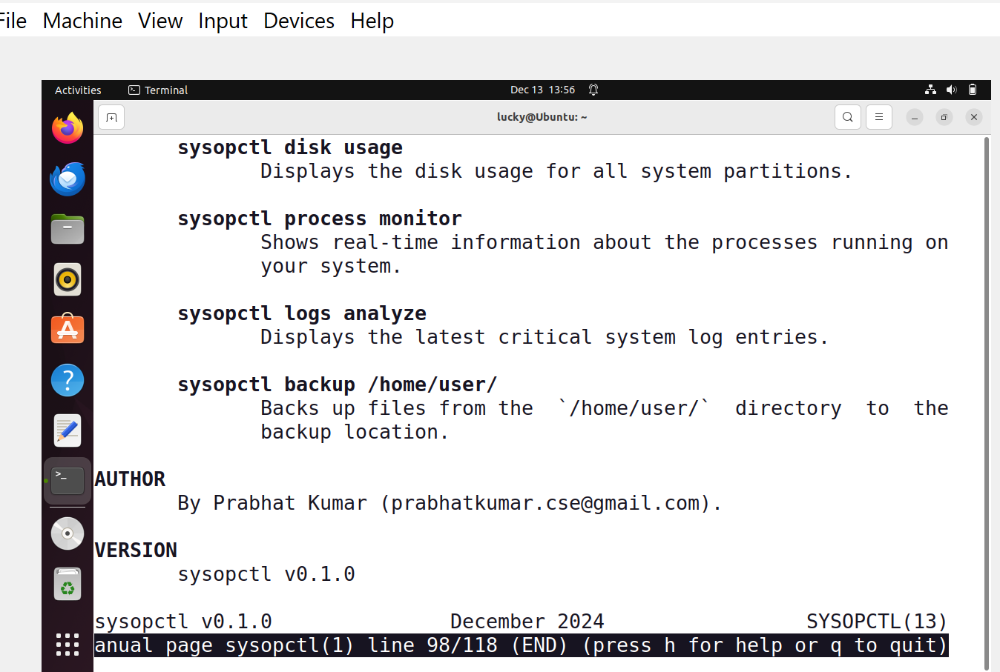

## Usage with screenshots
Run the `sysopctl` command with the desired options and commands:

### Display Version
```bash
sysopctl --version
```


### Display Help
```bash
sysopctl --help
```
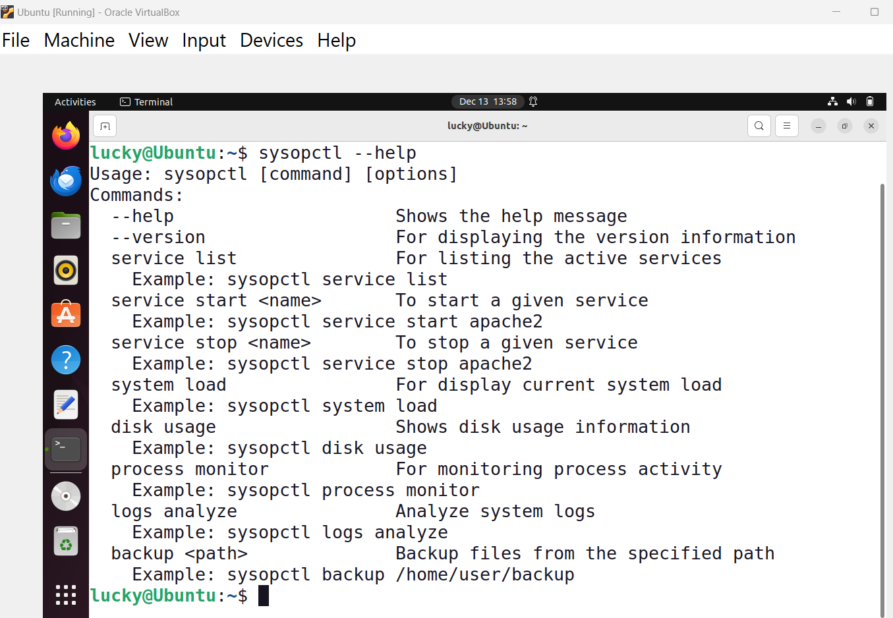

### Part 1:
- List running services:
  ```bash
  sysopctl service list
  ```
  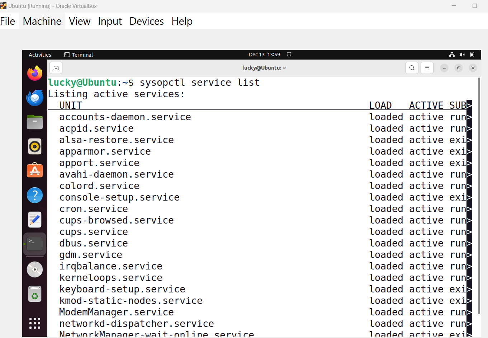
  
- System Load
```bash
sysopctl system load
```
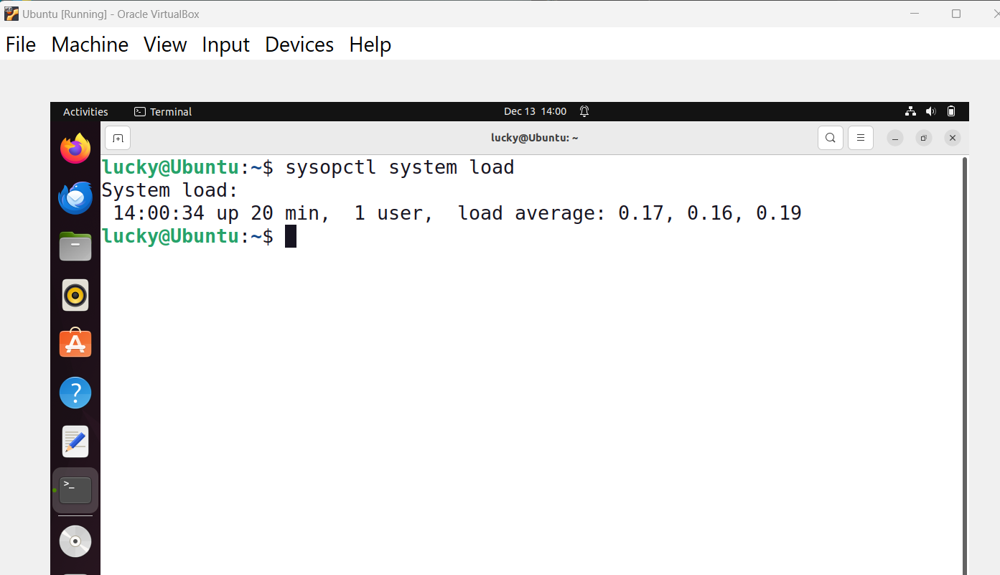
### Part 2:
- Start a service:
  ```bash
  sysopctl service start <service-name>
  ```
- Stop a service:
  ```bash
  sysopctl service stop <service-name>
  ```
  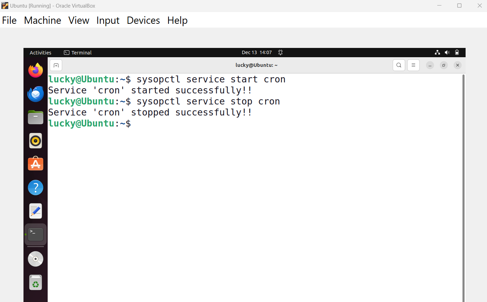

- Disk Usage
```bash
sysopctl disk usage
```


### Part 3
- Monitor System Processes
```bash
sysopctl process monitor
```
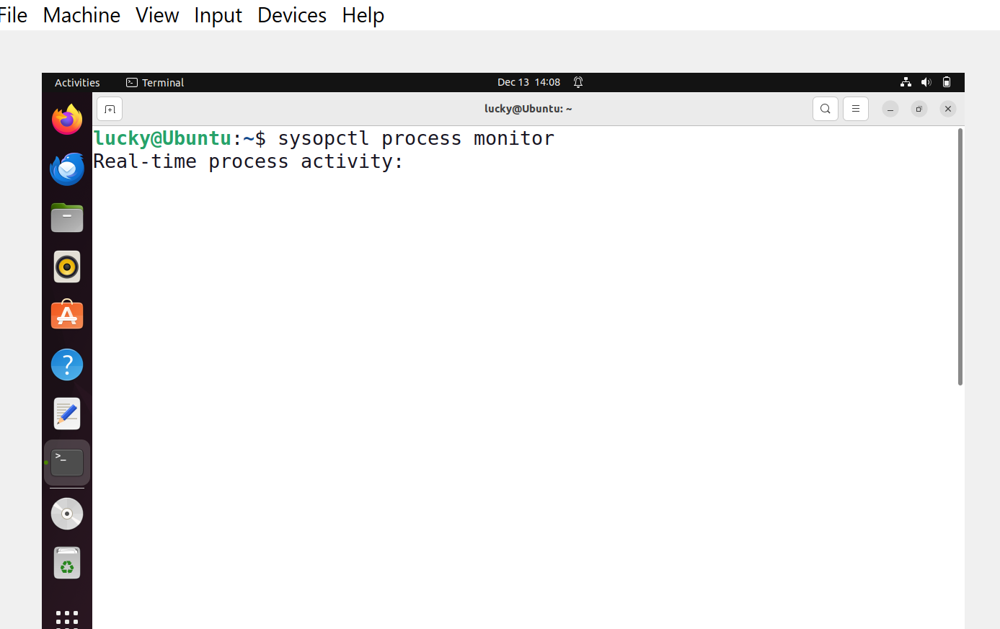
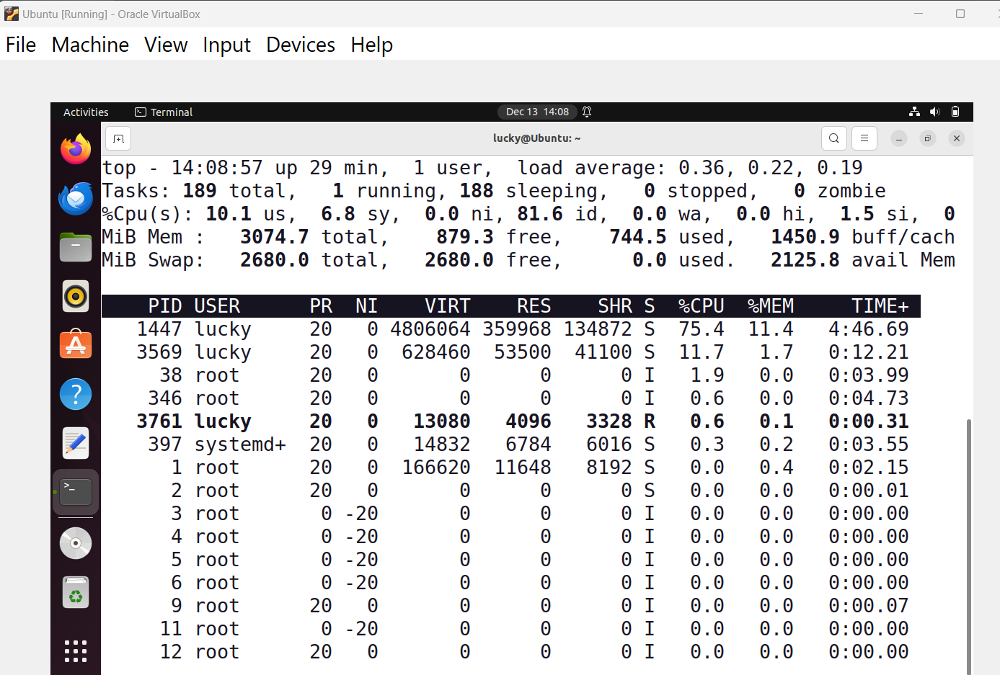
- Analyze System Logs
```bash
sysopctl logs analyze
```
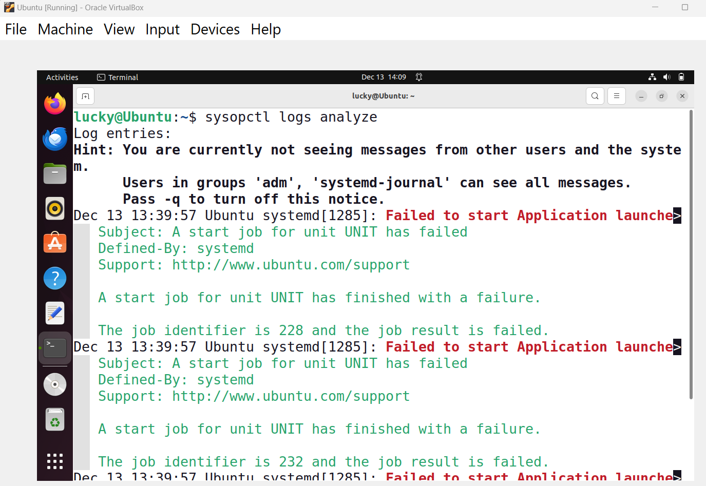

- Backup Files
```bash
sysopctl backup <path-to-backup>
```
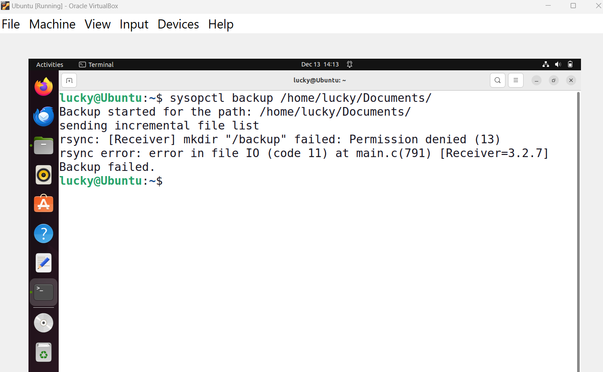


---------------------------------------------------------!! THANK YOU !!----------------------------------------------------------
